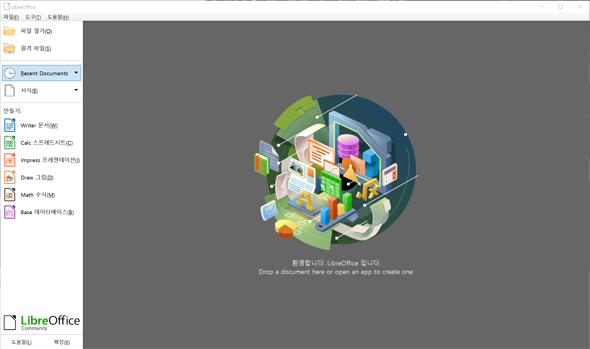

# 과제01: 준비하기

언어 데이터 처리 2022-11-14 장태준  
컴퓨터 공학부 2017-17018

> 수업 시간에 소개된 다음 소프트웨어들을 설치하여 컴퓨팅 환경을 구축한다.

## A. Visual Studio Code
1. Visual Studio Code 다운로드

- a. https://code.visualstudio.com/ 접속 후   
- b. 운영체제에 맞는 설치 파일 다운로드  

2. 설치파일 실행

- a. A-1. 에서 다운로드한 설치 파일을 실행  
- b. 필요한 설정을 하며 설치  

3. 설치 완료 후 확인  

- 바로 가기 아이콘을 더블클릭하여 실행

## B. 명령행 도구
  - Microsoft Windows: WSL 설치
1. MS의 [WSL 설치 페이지](https://learn.microsoft.com/ko-kr/windows/wsl/install)를 따라 WSL 설치  

2. Windows 검색창에서 Microsoft Store 검색 후 실행  

3. 검색창에 Ubuntu 검색 후 다운로드하여 설치  

4. 검색창에 Windows Terminal 검색 후 다운로드하여 설치  

5. Windows Terminal 을 통해 WSL Ubuntu 실행  

## C. 가상 머신에 Ubuntu 설치
1. Ubuntu 다운로드
- a.[Ubuntu 홈페이지](https://ubuntu.com/download/desktop)에서 다운로드   

- b. 기다리기  

- c. Ubuntu ISO 파일 확인하기  

2. Virtual Box 다운로드
- a. [Virtual Box 홈페이지](https://virtualbox.org)에서 다운로드  

- b. 기다리기  

- c. 설치 파일 실행 및 설치  

3. Virtual Box 실행 및 Ubuntu 설치
- a. Virtual Box 실행  

- b. 가상머신 새로 만들기  

- c. Ubuntu로 가상머신 부팅  

- d. Ubuntu 설치  

- e. Virtual Box 가상머신에서 Ubuntu 실행  

## D. Markdown 설치와 문법 익히기
  - Visual Studio Code에서 Markdown 확장팩 설치
  - 기타 원하는 경우 Markdown 편집기 설치

1. 좌측 메뉴에서 확장 또는 \<Ctrl\> + \<Shift\> + K
2. 검색창에 `markdown` 입력
3. `설치` 버튼을 눌러 설치

## E. 글꼴: D2Coding 설치
1. [D2Coding github release](https://github.com/naver/d2codingfont/releases)에 접속 후 `.zip` 파일 다운로드  

2. 다운로드된 `.zip` 파일을 압축해제  

3. `D2Coding` 폴더 안에 있는 글꼴 확인  

4. 글꼴 파일을 실행한 후 글꼴 설치  

## F. Python 3 설치
1. [Python 홈페이지](https://www.python.org/)에서 설치파일 다운로드  

> 자신의 운영체제에 맞는 파일 다운로드  

2. 설치파일을 실행하여 파이썬 설치  
> 반드시 Add python.exe to PATH 를 체크할 것  

3. CMD에서 `python` 명령어로 파이썬 실행  

## G. LibreOffice 설치
1. [LibreOffice 홈페이지](https://www.libreoffice.org/discover/libreoffice/)에서 설치파일 다운로드  

> 자신의 운영체제에 맞는 파일 다운로드  

2. 설치파일을 실행하여 LibreOffice 설치  

3. 설치된 LibreOffice 실행  
