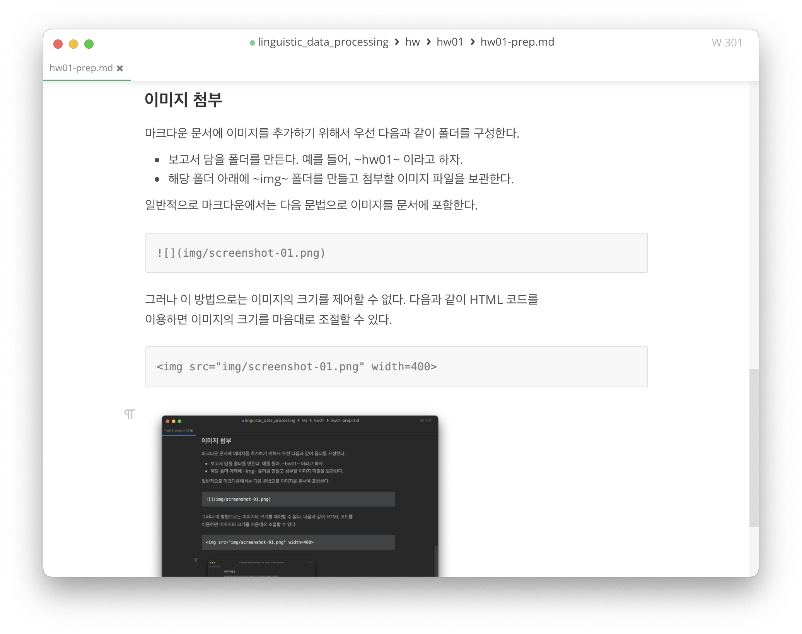

# 과제01: 준비하기

언어 데이터 처리 2022-11-08 유현조

## 할 일

수업 시간에 소개된 다음 소프트웨어들을 설치하여 컴퓨팅 환경을 구축한다.

- Visual Studio Code
- 명령행 도구
  - Linux를 설치하거나
  - macOS의 경우: Terminal.app 사용. Bash 사용. brew 설치
  - Microsoft Windows의 경우: Cygwin 또는 WSL 설치
- 가상 머신에 Ubuntu 설치
- Markdown 설치와 문법 익히기
  - Visual Studio Code에서 Markdown 확장팩 설치
  - 기타 원하는 경우 Markdown 편집기 설치
- 글꼴: D2Coding 설치
- Python 3 설치
- LibreOffice 설치

## 보고서 작성법

설치 및 설정 과정을 정리하여 보고서로 작성하여 제출한다.

- Markdown으로 작성하고 PDF로 출력하여 제출한다. 파일명은 `hw01-prep.pdf`로
  한다.
- 설치 과정과 결과를 보여줄 수 있도록 적절한 스크린샷을 포함하여 보고서를
  작성한다. 스크린샷을 지나치게 많이 찍을 필요는 없다. 
- Markdown 문법을 충분히 숙지하여 사용한다. 특히 제목(heading) 문법을 이용하여
  장절을 구분하여 작성하고 목록(list) 문법을 이용하여 개조식으로 간략하게
  설명을 작성하도록 한다. 
- 설치 과정에서 문제가 발생하였다면 그 자체를 보고서로 작성한다. 해결하지
  못하였더라도 보고서에 해당 내용을 기술한다. 해결하였다면 해결 과정을 함께
  기술한다.

## 마크다운 사용법

이 과제 지침은 마크다운으로 작성되어 있다. 함께 제공된 md 파일과 pdf 파일을
참고하면 보고서를 작성할 때 필요한 대부분의 마크다운 문법을 알 수 있다.

- 과제 지침의 pdf 파일은 MarkText라는 마크다운 전용 에디터의 내보내기(Export)
  기능을 이용하여 생성한 것이다.
- 이런 전용 에디터를 이용하면 마크다운 문법을 몰라도 메뉴를 이용해서 문서를
  구조화할 수 있다.
- 마크다운으로 문서를 작성할 때에는 모양에는 신경쓰지 말고 글의 구조를 잘
  드러낼 수 있도록 작성한다.

### 제목

제목(heading)은 6단계를 지원하며 `#` 기호로 시작하면 된다.

```markdown
# H1 제목 1 수준
## H2 제목 2 수
### H3 제목3
```

### 이미지 첨부

마크다운 문서에 이미지를 추가하기 위해서 우선 다음과 같이 폴더를 구성한다.

- 보고서 담을 폴더를 만든다. 예를 들어, `hw01`이라고 하자.
- 해당 폴더 아래에 `img` 폴더를 만들고 첨부할 이미지 파일을 보관한다. 

일반적으로 마크다운에서는 다음 문법으로 이미지를 문서에 포함한다.

```markdown

```

그러나 이 방법으로는 이미지의 크기를 제어할 수 없다. 다음과 같이 HTML 코드를
이용하면 이미지의 크기를 마음대로 조절할 수 있다.

```html

```


### 목록

목록에는 번호 있는 목록과 번호 없는 목록이 있다. 번호 없는 목록은 다음과 같이 만들 수 있다.

```
- item
- item
- item
```

번호 있는 목록은 다음과 같이 만들 수 있다.

```
1. item
2. item
3. item
```

### 표

표는 다음과 같이 만들 수 있다.

| 운영체제              | Visual Studio Code | Notepad++ | BBEdit | gedit |
|:----------------- |:------------------:|:---------:|:------:|:-----:|
| Linux             | O                  | X         | X      | O     |
| macOS             | O                  | X         | O      | O     |
| Microsoft Windows | O                  | O         | X      | X     |

### 수식

수식도 입력할 수 있다.  문장 중에 수식을 입력할 때에는 `$` 기호로 둘러싸 $f(x)=x+1$과 같이 입력할 수 있다. 독립적인 행을 차지하는 수식을 입력할 때에는 `$$` 기호로 둘러싸면 된다.

$$
\sum_{k=1}^n k = \frac{n(n+1)}{2}
$$


