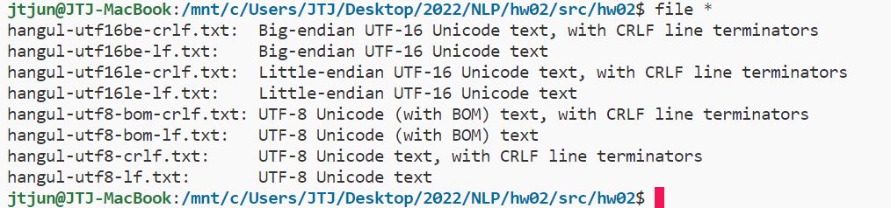

# 과제02: 인코딩과 글꼴

언어 데이터 처리 2022-11-14 장태준 [컴퓨터 공학부 2017-17018]
[https://github.com/jtjun/NLP/blob/main/hw01/result/hw01.md](https://github.com/jtjun/NLP/blob/main/hw02/hw02.md)

## 1. 인코딩
### A. 다양한 형식의 텍스트 파일


### B. HEX 코드
#### `hangul-utf8-lf.txt`
```c
0000000 95ed ea9c 80b8 000a
0000007
```

#### `hangul-utf8-crlf.txt`
```c
0000000 95ed ea9c 80b8 0a0d
0000010
```

#### `hangul-utf8-bom-lf.txt`
```c
0000000 bbef edbf 9c95 b8ea 0a80
0000012
```

#### `hangul-utf8-bom-crlf.txt`
```c
0000000 bbef edbf 9c95 b8ea 0d80 000a
0000013
```

#### `hangul-utf16le-lf.txt`
```c
0000000 feff d55c ae00 000a
0000010
```

#### `hangul-utf16le-crlf.txt`
```c
0000000 feff d55c ae00 000d 000a
0000012
```

#### `hangul-utf16be-lf.txt`
```c
0000000 fffe 5cd5 00ae 0a00
0000010
```

#### `hangul-utf16be-crlf.txt`
```c
0000000 fffe 5cd5 00ae 0d00 0a00
0000012
```

한글: 
- utf8: `ed 95 9c ea b8 80`
- utf16le: `d55c ae00`
- utf16be: `5cd5 00ae`

BOM: 
- utf8: `ef bb bf`
- utf16le: `feff`
- utf16be: `fffe`

줄바꿈
- lf: `0a`
- crlf: `0d 0a`  

`od` 명령어는 octal dump라는 의미로, 바이너리 파일을 8진수로 dump 하는 명령어다. (https://linuxhint.com/linux-od-command/)  
위 실습에선 `-x` 옵션을 통해서 16진수 HEX 코드로 출력했다.  
```shell
od -x {file_name}
```

### C. 명령행 도구들

## 2. 글꼴
