# 과제03: 데이터와 텍스트

언어 데이터 처리 2022-11-27 장태준 [컴퓨터 공학부 2017-17018]
[https://github.com/jtjun/NLP/blob/main/hw03/hw03.md](https://github.com/jtjun/NLP/blob/main/hw03/hw03.md)

## 1. 개방형 표준
### A. 개방형 표준(open standard)
개방형 표준(open standard), 공개 표준은 기술 표준이 문서가 공개되어 있으며 사용이 자유로운 경우를 가리키는 용어이다.  
개방형 표준은 상황에 따라 다른 정의가 존재하며, 가령 여러 표준 단체나 국가마다 서로 다른 정의를 가진다. 일반적으로 포함되는 개념은 표준을 사용하는 데에 있어서 로열티를 지불할 필요가 없다는 점이다. 이때 일부 경우는 기술 표준을 사용하는 데에 특허 라이선스가 필요하며, 합리적이고 비차별적인(RAND) 라이선스를 허용하는 하에 해당 표준을 개방형 표준으로 인정하기도 하다.  
따라서 개방형 표준은 통합된 환경을 제공할 수 있어, 소프트웨어 - 기업 - 나라 간의 상호작용에서 발생할 수 있는 비용을 감소시키며, 종속성 문제를 해결한다. 실시간으로 국가간 데이터를 교환하는 글로벌 시대에 이러한 개방형 표준은 핵심적인 역할을 하고 있다.

### B. 개방형 표준 중 파일 형식
- ODF (OpenDocument Format) : ISO 문서 표준 형식
- OOXML (Offce Open XML) : Microsfot에서 공개한 ISO 표준 문서
형식
- PDF (Portable Document Format) : Adobe에서 공개한 서식 있는
문서를 위한 ISO 표준 형식
- PNG (Portable Network Graphics) : 비트맵 이미지 ISO 표준 형식
- HTML (Hypertext Markup Language): (W3C)
- SVG (Scalable Vector Graphics) : 벡터 그래픽을 위한 오픈 포맷
(W3C)
- Ogg : 멀티미디어를 위한 오픈 포맷

### C. ODF 와 OOXML 그리고 OWPML
ODF는 OASIS 컨소시엄 산하 기술위원회(Technical Committee; TC)가 제정하였다. ODF-TC에는 많은 업체들과 개인이 동등한 자격으로 참가하고 있으며, 많은 오피스 프로그램과 관련 문서 시스템의 개발자들이 표준화 작업을 진행하고 있다.  
이에 반해 OOXML은 마이크로소프트가 추진하였으며 2006년과 2008년 두 차례에 걸쳐 Ecma 인터내셔널에 유럽 표준(ECMA-376)으로, 2008년에 ISO/IEC에 국제 표준(ISO/IEC 29500)으로 승인되었다.  
한 편, 두 표준모두 머신리더블한 포맷이기에, 별도의 데이터 처리 과정을 거치거나 특수한 프로그램을 사용하지 않고 문서에 담긴 데이터를 다룰 수 있다. 그러나 우리 나라에서 널리 쓰이는 아래아한글의 경우, 머신리더블하지 않은 hwp 형식을 사용하고 있었다.  
디지털전환이 가속화됨에 따라 전자문서 데이터의 중요도가 더욱 높아지고 있는 만큼, 아래아한글을 머신리더블한 HWPX로 본격 변환함으로써 전자문서 국제 표준화를 선도하고 활용도를 더욱 넓혀 나가기 위해 OWPML을 개발하여 국가표준으로 등록하였다.

 

## 2. 형식별 실습
각 형식이 어떻게 구성되어 있는지 살펴보고 텍스트로 된 데이터로서 사용하는 실습  
수업 실습 영상강의를 참조, 실습 과정을 스크린샷을 이용하여 보여주고 텍스트로 된 데이터의 구조를 코드블럭으로 예시하고 설명과 의견을 포함하여 보고서를 작성

### A. ODF 중 ODT 형식 (워드프로세서)
1. Libre Office로 ODT 파일 만들기

'컴퓨터 공학부 장태준'이라는 내용으로 새로운 파일을 만든다.

'.odt'형식으로 파일을 저장한다.

2. VS Code에서 확인하기

먼저, hex-editor로 파일을 확인해본다.

3. 압축해제
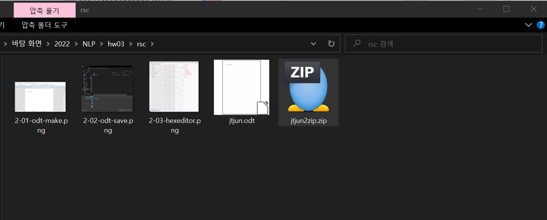
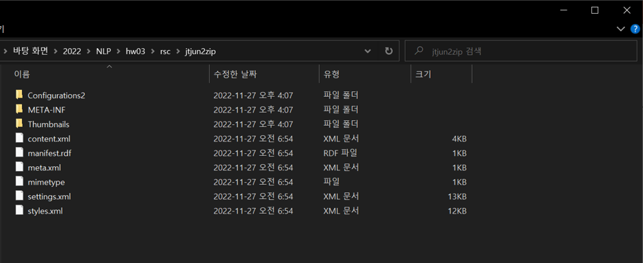
확장자를 zip으로 변경한 뒤 압축해제 한다.

압축해제된 폴더를 VS Code로 확인해본다. 위 캡쳐는 mimetype 파일이다.

4. `content.xml` 확인

확장 기능을 통해 wrap 형식으로 `content.xml` 파일을 확인해본다.

맨 아래 줄에 입력한 내용, '컴퓨터 공학부 장태준'이 들어가있는 것을 확인할 수 있다.

5. xml 에서 변경 후 확인하기
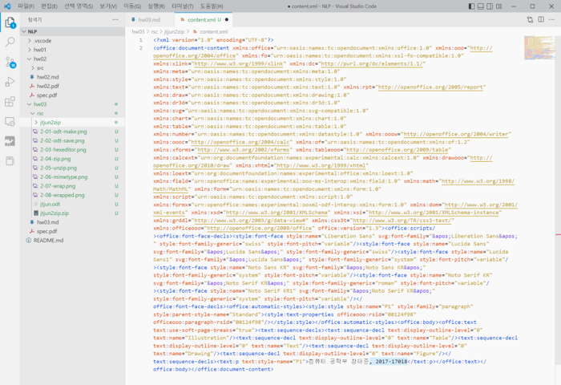
맨 아래 줄에 내용을 추가하고,

다시 압축한 뒤, 확장자를 `.odt`로 변경하여 내용을 확인한다.

xml에서 변경한 내용이 제대로 반영되어있는 것을 확인할 수 있다.

5. odt 에서 변경 후 확인하기

odt에서 새로운 라인을 추가하고 위의 과정을 반복해, content.xml 파일을 확인한 결과이다.
라인이 변경되었기 때문에 새로운 태그가 생긴 것을 볼 수 있다.

### B. OOXML 중 DOCX 형식
1. MS Word로 DOCX 파일 만들기
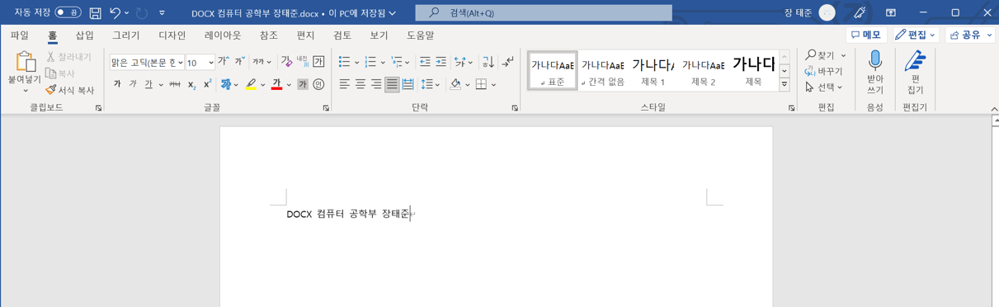
'DOCX 컴퓨터 공학부 장태준'이라는 내용으로 새로운 파일을 만든다.

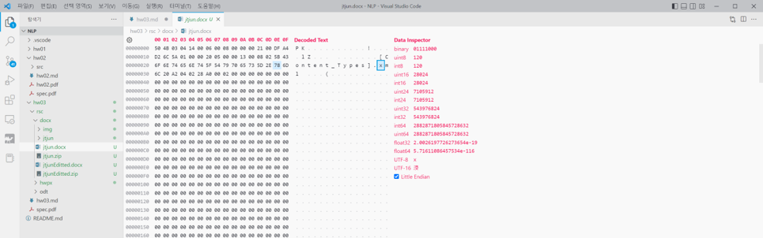
VS Code에서 hex-editor로 docx파일을 확인한 결과는 위와 같다.

2. 압축 해제

확장자를 zip으로 변경한 뒤 압축해제 한다.

3. `\word\document.xml` 확인

확장 기능을 통해 wrap 형식으로 `\word\document.xml` 파일을 확인해본다.
입력한 내용, '컴퓨터 공학부 장태준'이 들어가있는 것을 확인할 수 있다.

4. xml에서 변경 후 확인하기
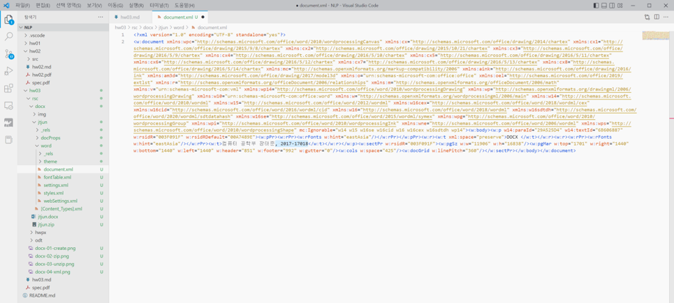
기존 내용의 옆에 ', 2017-17018'를 추가한다.

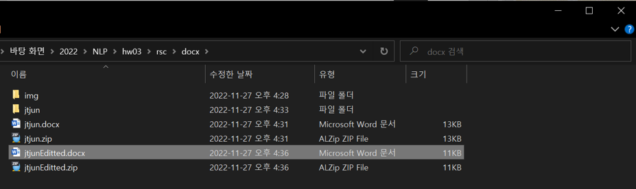
다시 압축한 뒤, 확장자를 `.docx`로 변경한다.

5. 결과
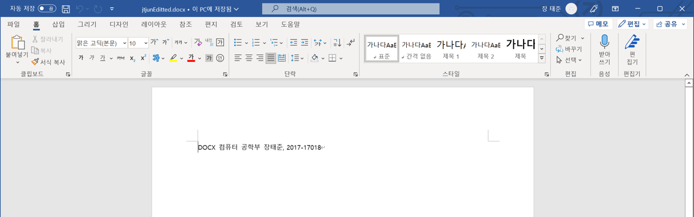
MS Word에서 위 파일을 확인한 결과, 변경한 내용을 확인할 수 있었다.

### C. HWPX 형식
1. 한컴 오피스로 hwp 파일 만들기

'HWPX 컴퓨터 공학부 장태준'이라는 내용으로 새로운 파일을 만든다.

VS Code에서 hex-editor로 hwpx파일을 확인한 결과는 위와 같다.

2. 압축 해제

확장자를 zip으로 변경한 뒤 압축해제 한다.

3. `\Contents\section0.xml` 확인
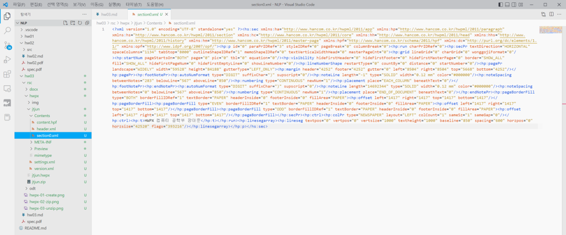
확장 기능을 통해 wrap 형식으로 `\Contents\section0.xml` 파일을 확인해본다.
입력한 내용, '컴퓨터 공학부 장태준'이 들어가있는 것을 확인할 수 있다.

4. xml에서 변경 후 확인하기

기존 내용의 옆에 ', 2017-17018'를 추가한다.

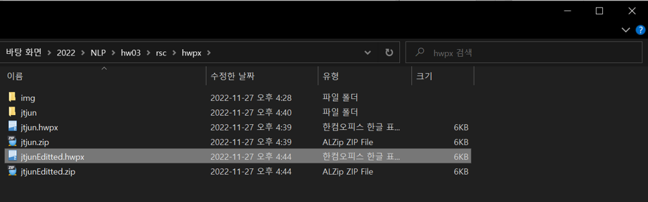
다시 압축한 뒤, 확장자를 `.hwpx`로 변경한다.

5. 결과
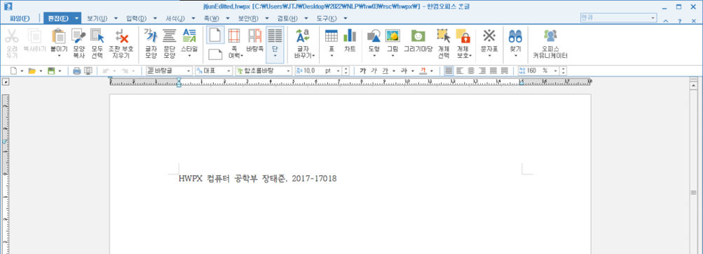
MS Word에서 위 파일을 확인한 결과, 변경한 내용을 확인할 수 있었다.

 

## 3. 테이블형 데이터
### A. 간략한 테이블형 데이터 ODT 형식
- 자유로운 주제로 만드시면 됩니다. 
- 3열 이상 10행 이상의 규모

1. Libre Office 에서 표 생성

상단의 도구표시줄에서 '표'를 클릭한 뒤, '표 삽입'을 클릭한다.

2. 표(table)의 크기 설정 

행과 열을 설정하여, 표의 크기를 결정한다.  
여기선, 과제의 요구사항에 맞춰, 3열 10행의 표를 생성하였다.

3. 내용 채우기

이후 실습에서 각 위치가 제대로 보존되는지 확인하기 위해 알파벳과 숫자를 조합에 좌표를 표시하였다.  
행은 알파벳으로, 열은 숫자로 나타냈다.

4. ODT 형식으로 저장
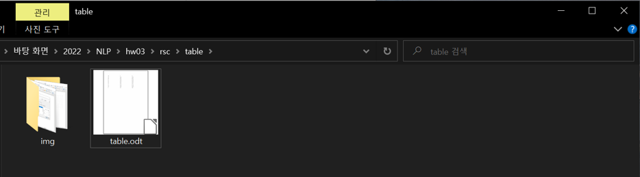
이렇게 생성한 표를 odt 형식으로 저장한다.

### B. LibreOffice를 이용한 ODS 형식
1. Libre Office 에서 표 생성

LibreOffice를 실행하여 `calc` 새 파일을 생성한다.

3. 내용 채우기
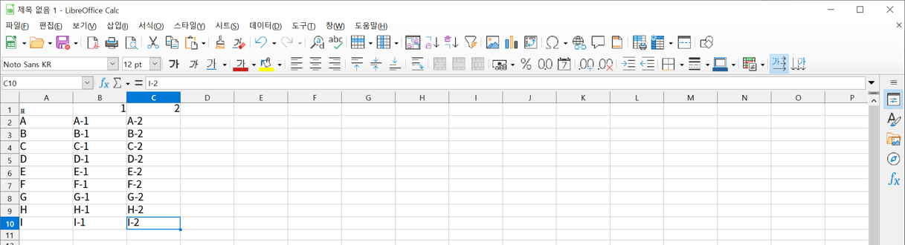
A.에서 만든 표와 동일한 내용을 채운다.

4. ODS 형식으로 저장

이렇게 생성한 표를 ods 형식으로 저장한다.

### C. Visual Studio Code에서 CSV 형식
1. CSV 파일 만들기
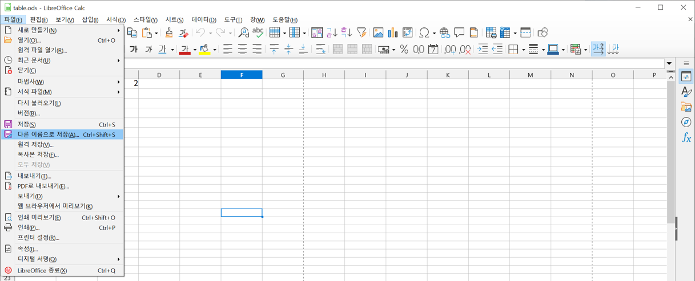
B에서 만든 ODS 파일을 Libre Office로 연 후, 다른 이름으로 저장한다.

이때 확장자를 꼭 `.csv`로 설정한다.
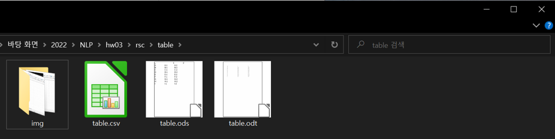
CSV 파일이 생성된 것을 확인할 수 있다.

2. VS code 확장 프로그램으로 확인
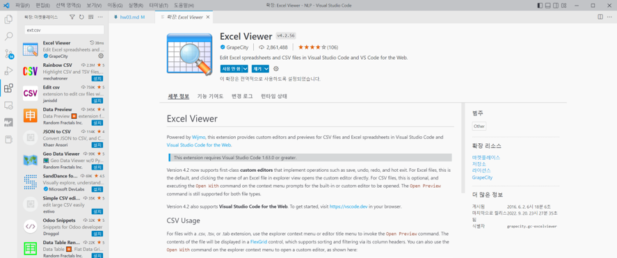
`Excel Viewer`라는 확장 프로그램을 설치한다.

CSV 파일을 연 뒤, 우측 상단에 있는 preview 버튼을 클릭한다.

3. 결과

첫번째 칸에 한글로 작성한 `표`가 깨져서 나오는 것을 확인할 수 있다.

### D. LibreOffice를 이용한 TSV 형식
1. VS Code에서 CSV를 TSV로 바꾸기

VS Code에서 CSV 파일을 열고, 가장 처음에 있는 ','를 선택한다.

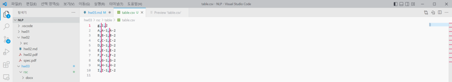
모든 ','가 선택될 때까지 `<Ctrl> + d`를 연속해서 누른다.

선택된 모든 ','를 `<TAB>`으로 변경한다.  
이때, VS Code의 설정에 따라 `<TAB>`이 아닌 여러 개의 `<Space>`로 변경될 수 있으니 주의한다.

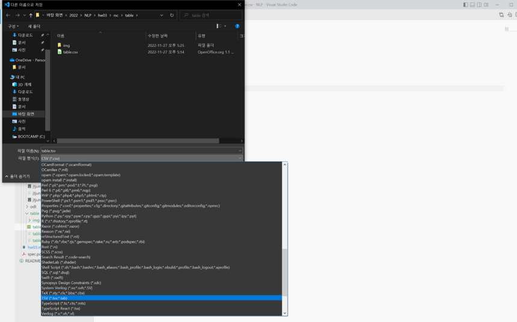
다른 이름으로 저장을 클릭하여, `.tsv` 확장자로 저장한다.

2. Libre Office에서 확인하기 

Libre Office를 실행하여 '파일 열기' 버튼을 누른다.

3-D-1.에서 저장한 TSV 파일을 선택한다.

위처럼 '텍스트 가져오기'가 나타나는데, 구분 기호 옵션을 '탭'으로 나누기로 설정한다.

3. 결과

CSV와 동일한 결과를 확인할 수 있다.

### E. 소프트웨어들 사이에 데이터를 주고 받기
|   |   CSV |   TSV |
|---|:-----:|:-----:|
|Excel|깨졌던 '표'글씨가 정상적으로 나타난다.|Libre Office처럼 파일을 열 수 있었다.|
|Google|'표'글씨가 깨졌다.|Libre Office와 같다.|
|Naver|경고 메시지가 나타났으나, 정상적으로 파일을 열 수 있었다.|TSV를 지원하지 않아 파일이 열리지 않고 다운로드 되었다.|