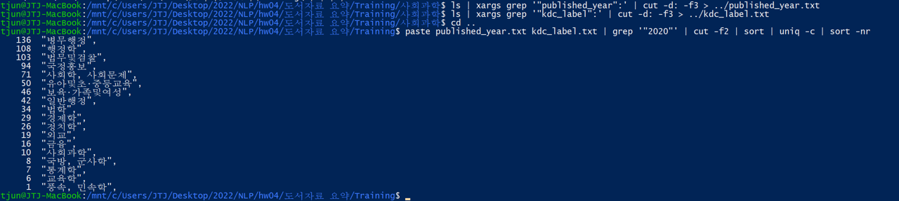

# 과제04: 데이터 처리 실습

언어 데이터 처리 2022-12-14 장태준 [컴퓨터 공학부 2017-17018]
[https://github.com/jtjun/NLP/blob/main/hw04/hw04.md](https://github.com/jtjun/NLP/blob/main/hw04/hw04.md)

## 1. 데이터
### A. 소제목
Ai Hub에 가입/로그인한 뒤, 데이터를 다운 받았다.

이 [링크](https://aihub.or.kr/aihubdata/data/view.do?currMenu=115&topMenu=100&aihubDataSe=realm&dataSetSn=93)를 통해 위의 페이지에 접속할 수 있다.

`[원천]도서요약_train.zip`을 해제한 결과는 다음과 같다.


## 2. 파일 개수
```
find .
```
명령어를 입력하는 경우, 모든 파일 목록이 출력 된다.

```
find . | cut -d/ -f2
```
명령어의 경우, 각 파일의 directory명 즉, '기술과학', '기타', '사회과학', '예술' 4가지가 파일 개수 별로 출력 된다.

```
find . | cut -d / -f2 | sort
```
명령어의 경우, 위의 결과가 정렬되어서 출력된다.

```
find . | cut -d / -f2 | sort | uniq -c
```
최종 명령어의 경우, 폴더 별 파일 개수의 통계가 출력된다.


## 3. 주제별 빈도
```
 grep '"kdc_label":' PCY_2020* | cut -d: -f3 | sort | uniq -c | sort -nr
```
위 명령어를 통해 '사회과학' 폴더를 확인한 결과는 다음과 같다.


추가적으로, '기술과학' 폴더에 대해 동일한 명령어를 실행한 결과는 다음과 같다.


## 4. 출판 연도별 파일 개수
```
ls | xargs grep '"published_year":' | cut -d: -f3 | sort | uniq -c
```
위 명령어를 통해 '사회과학' 폴더를 확인한 결과는 다음과 같다.


추가적으로, '기술과학' 폴더에 대해 동일한 명령어를 실행한 결과는 다음과 같다.


## 5. 출판 연도별 주제 빈도
```
ls | xargs grep '"published_year":' | cut -d: -f3 > ../published_year.txt
ls | xargs grep '"kdc_label":' | cut -d: -f3 > ../kdc_label.txt
cd ..
paste published_year.txt kdc_label.txt | grep '"2020"' | cut -f2 | sort | uniq -c | sort -nr
```
위 명령어를 순서대로 실행한 결과는 다음과 같다.



```
paste published_year.txt kdc_label.txt | grep '"2019"' | cut -f2 | sort | uniq -c | sort -nr
```
다음으로 위 명령어를 실행한 결과는 다음과 같다.


## 6. 도서 설명의 단어 빈도
```
grep '"passage":' PCY_2020* | cut -d: -f3 | awk '{for(i=1;i<=NF;i++) print $i}' | sort | uniq -c | sort -nr | head -20
```
위 명령어를 실행한 결과는 다음과 같다.


----

# 과제05: 데이터 처리 실습

## 7. CSV과 JSON을 위한 명령행 도구
먼저, `xsv`, `cvkit`, `jq`를 설치하였다.

### A. `xsv` 설치
```
curl https://sh.rustup.rs -sSf | sh
```
github에 명시된 안내에 따라, 위 명령어로 `Cargo`를 먼저 설치한 뒤,
```
cargo install xsv
```
명령어를 입력하여 `xsv` 설치를 완료하였다.

### B. `cvkit` 설치
[csvkit 홈페이지의 tutorial](https://csvkit.readthedocs.io/en/latest/tutorial/1_getting_started.html)에 명시된 대로
```
sudo pip install csvkit
```
명령어를 통해 csvkit을 설치하였다.

### C. `jq` 설치

```
sudo apt-get install jq
```
jq 홈페이지의 download 에 명시된 명령어를 통해 `jq`를 설치하였다.

### D. 실습

## 8. 파일 정리
